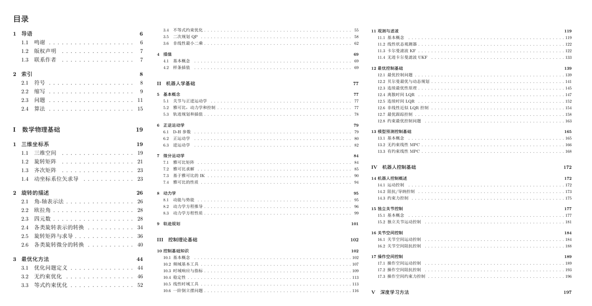
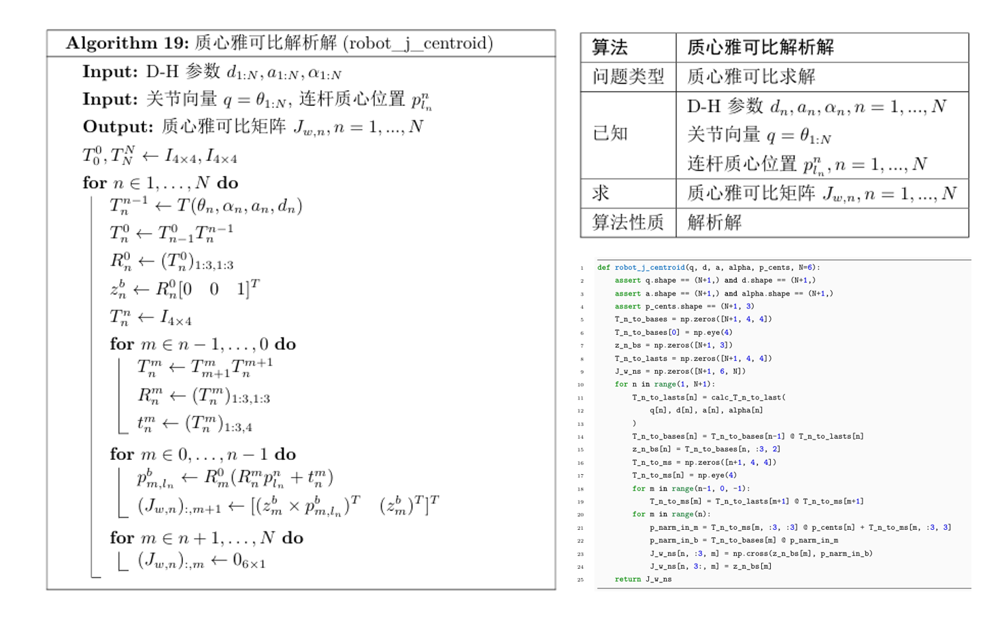
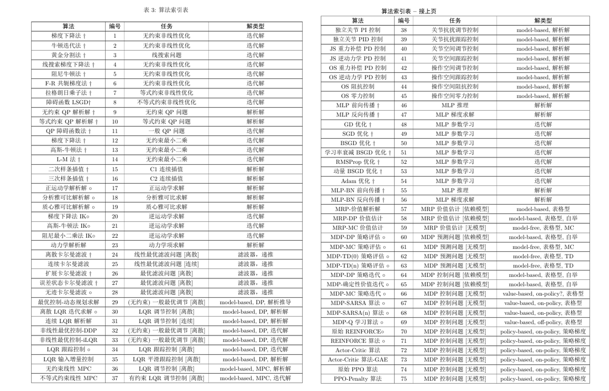
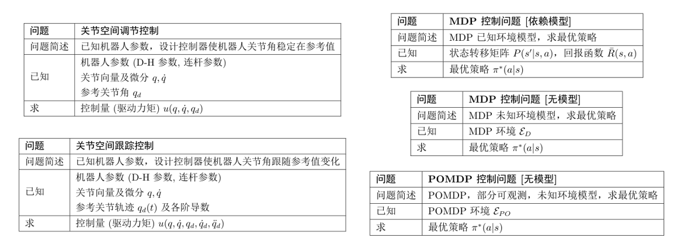
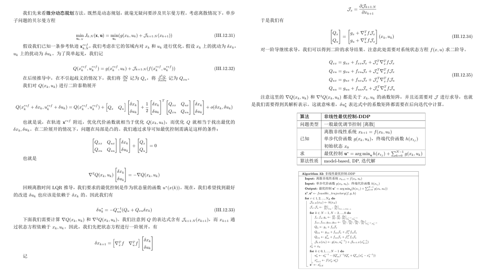
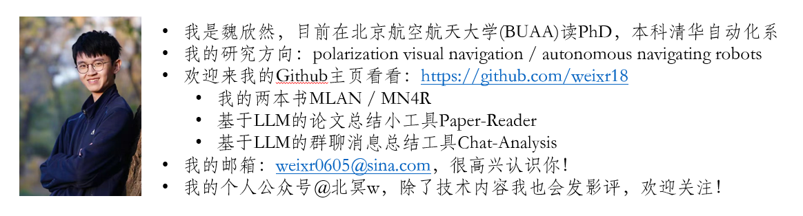

# Math Toolbox for Robotics (MT4R)

MT4R is a robotics reference book I authored with the goal of making mathematical derivations in various foundational areas of robotics more accessible. 

MT4R 是我独立撰写的一本机器人技术工具书，致力于降低机器人学各基础领域中数学推导的学习门槛。

## Features / 内容特色

本书包括了七大部分：**数学物理基础、机器人学基础、控制理论基础、机器人控制基础、深度学习方法、强化学习方法、视觉导航方法**，旨在介绍相应领域的关键问题、基础算法、公式推导、代码实现等等。

This book is divided into seven main parts: **Fundamentals of Mathematical Physics, Fundamentals of Robotics, Fundamentals of Control Theory, Fundamentals of Robot Control, Deep Learning Methods, Reinforcement Learning Methods, and Visual Navigation Methods**. It aims to introduce key issues, fundamental algorithms, formula derivations, code implementations, and more in each respective field.

本书最大的特点是：**算法核心、编程友好**。除了给出明确的数学公式推导外，还给出了算法流程、算法总结、python代码。这其中，本书创新性地用**类python**风格重写了每一种算法的算法流程，明确了每一种算法的已知/求（完全对应python代码参数），最大程度地保持算法和python代码的变量名一致，尽力实现**从算法到代码实现的无缝衔接**。

The most prominent features of this book are: **algorithm-centered and programming-friendly**. In addition to providing clear mathematical formula derivations, it also offers algorithm flows, algorithm summaries, and Python code. Innovatively, this book **rewrites the algorithm flow of each algorithm in a Python-like style**, clarifying theknowns and unknowns (which directly correspond to Python function parameters) and strives to keep variable names consistent between algorithms and Python code to achieve a **seamless transition from algorithm to code implementation**.

本书详细梳理了机器人领域90余种重要算法。对于一些关键算法，区分了不同版本进行介绍(例如LQR算法，本书同时介绍了其连续和离散版本)，使其应用范围清晰明确，也方便读者和各种其他资料相互对照。

This book meticulously organizes over 90 important algorithms in the field of robotics. For some key algorithms, different versions are introduced separately (for example, the LQR algorithm is presented in both continuous and discrete versions), making their application scope clear and definite, and facilitating readers' cross-referencing with various other materials.

在算法推导方面，我在写作的过程中力求语言清晰、简洁明确，基本实现了：**本书中任何算法出现的任何物理量、参数、系数等等，都有明确的文字或公式定义**，都清晰标明了向量还是标量。对于一些较难理解或较重要的概念，在章节开头也有统一的描述、介绍、定义等等。

Regarding algorithm derivation, I strived for clear, concise, and precise language during the writing process, essentially achieving: **Any physical quantity, parameter, coefficient, etc., that appears in any algorithm in this book has a clear textual or formulaic definition**, and it is clearly marked whether it is a vector or a scalar. For some difficult-to-understand or particularly important concepts, there are also unified descriptions, introductions, and definitions at the beginning of the chapters.

如何在**详细性**和**简洁性**之间取得平衡，一直是对于此类书籍的写作的一大矛盾，需要有所取舍。作为一本工具性书籍，我选择**追求算法和代码层面的实用性和语言的清晰简洁**，而非大部分教科书遵照的的全面性。对于书中出现的一些基础概念，只会简单介绍而不会展开(因此可能不适合作为完全0基础入门的教材)。总之，**本书不求替代现有的教科书**；恰恰相反，我希望站在他们的肩膀上，为读者们提供更多的便利。

Balancing **detail** and **conciseness** has always been a major challenge in writing such books, requiring trade-offs. As a practical reference book, I chose to **pursue practicality at the algorithm and code level and clarity and conciseness of language**, rather than the comprehensiveness typically found in most textbooks. For some basic concepts that appear in the book, they are only briefly introduced and not expanded upon (thus, it might not be suitable as a textbook for complete beginners). In summary, **this book does not seek to replace existing textbooks**; on the contrary, I hope to stand on their shoulders to provide more convenience for readers.

此外，本书还清晰梳理了60多种相关技术问题。问题是算法的灵魂，工程师就是为解决问题而生。一方面，我希望通过对问题本身的**定义、梳理、整理**，使读者具有对算法的清晰理解。另一方面，通过定义问题，就可以**横跨不同领域/不同学科对算法进行对比**，分析其共同点、相同点、逻辑关联性，帮助读者建立更广阔的技术视野，拓宽技术栈。

Furthermore, this book clearly outlines over 60 related technical problems. Problems are the soul of algorithms, and engineers are born to solve them. On one hand, I hope that through the **definition, sorting, and organization** of the problems themselves, readers will gain a clear understanding of the algorithms. On the other hand, by defining problems, we can **compare algorithms across different fields/disciplines**, analyze their commonalities, similarities, and logical connections, helping readers build a broader technical perspective and expand their technical stack.

我相信，这本书将会为大家带来不一样的体验，成为大家工作和学习中的得力助手ヽ(●´∀●)ﾉ`

I believe this book will provide a unique experience and become a valuable assistant in your work and studies ヽ(●´∀`●)ﾉ

## Feedback and Sharing / 反馈与分享

本书的**中/英文PDF版本**(已完成部分预览版)和**配套代码**(已完成部分)已发布于本仓库，**欢迎大家下载阅读&讨论&提各种意见建议**！如果您觉得有帮助，可以给我一个星星⭐，非常感谢！

The **Chinese/English PDF versions** (partial preview versions are available) and **supporting code** (partially completed) of this book have been released in this repository. **Everyone is welcome to download, read, discuss, and provide suggestions and feedback!** If you find it helpful, please give me a star⭐—thank you so much!

目前，这本书(包括正文和代码)已经完成了约80%的内容，剩余部分仍在写作中，因此我发布的是**预览版**而非完整版。当前中文版本已经有340+页。在这之中，一些章节还没有完成，部分算法还没有配套代码，一些代码也还没有完成验证。这些暂未完成的部分都在书中的相应部分进行了标注。

Currently, this book (including the main text and code) is about 80% complete. The remaining parts are still being written, so what I have released is a **preview version**, not the complete version. The current Chinese version already has 340+ pages, while the English version contains 300+. Among these, some chapters are not yet finished, some algorithms lack supporting code, and some code has not yet been fully verified. These incomplete parts are marked in the corresponding sections of the book.

对于本书中所有已完成和计划完成的部分，如果您有任何意见或建议，或您有意愿贡献代码/修复bug，**欢迎您通过给本仓库提issue或邮件**(weixr0605@sina.com)**的方式联系我**！如果您的意见被采纳，您将被列入本书的致谢列表中。

For all completed and planned parts of this book, if you have any opinions or suggestions, or if you are willing to contribute code/fix bugs, **please feel free to contact me by submitting an issue to this repository or via email** (weixr0605@sina.com)! If your suggestion is adopted, you will be listed in the acknowledgments section of this book.

由于将来可能会和出版商联系出版，为保护版权，并避免潜在的法律风险，目前本书的PDF采取了限制传播和修改的措施，禁止一切未经允许的商业目的的再分发和传播，也禁止一切形式的对PDF本身的修改。配套代码部分使用GPLv3协议开源。**对于勘误、个人学习和交流目的，欢迎您下载和分享，诚挚感谢您的宝贵意见和建议**！

As there may be plans to contact publishers for future publication, to protect copyright and avoid potential legal risks, the current PDF of this book has restrictions on distribution and modification. Redistribution and dissemination for any commercial purpose without permission are prohibited, as is any form of modification to the PDF itself. The supporting code is open-sourced under the GPLv3 license. **For errata, personal study, and exchange purposes, you are welcome to download and share it. Sincere thanks for your valuable opinions and suggestions!**

## About me / 关于作者

